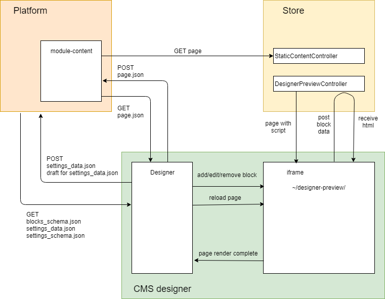

# cms-designer

Внедрение дизайнера затрагивает следующие части системы

* платформа
* module-content
* store
* theme

## Платформа

В платформе добавляется обработка CORS, для этого я добавил настройки `cors:origins`, `cors:headers`, `cors:methods`, `cors:credentials`.
Если дизайнер запускается на другом домене, то обязательно надо выставить `credentials` в `true`, а `origins` должен содержать полное имя домена где расположен дизайнер.
Это необходимо для того, чтобы браузер отправлял в платформу куки авторизации, а платформа корректно обрабатывала такие запросы.

Дизайнер запрашивает у платформы следующие файлы:

* `/<theme>/config/blocks_schema.json` — настройки блоков, которые используются в дизайнере
* `/<theme>/config/settings_data.json` — настройки темы
* `/<theme>/config/settings_schema.json` — схема настроек темы, описаны типы свойств, значения по умолчанию, возможные ограничения и пр.

Дизайнер загружает в платформу следующие файлы:

* `/<theme>/config/settings_data.json` — настройки темы
* `/<theme>/config/drafts/<unique_string>_settings_data.json` — черновик настроек, используется для предпросмотра темы в сторе (подробности ниже)
* изображения для контролов загружаются стандартными методами в assets через соответствующий api (`api/platform/assets`)

## module-content

Добавлен blade, который позволяет добавлять страницу для дизайнера, работать с её настройками

* `name` — имя файла
* `layout` — тема, список сейчас задаётся в коде блейда
* `header` — заголовок страницы
* `permalink` — user-friendly путь к странице на фронте
* `meta-title` — метазаголовок страницы
* `meta-description` — метаописание

Взаимодействие дизайнера с модулем

* `api/content/{contentType}/{storeId}?relativeUrl=<filename>` — запрашивает страницу через стандартный api
* `api/content/{contentType}/{storeId}?folderUrl=<path>` — загружает файл в платформу, файл содержится в боди запроса (multipart/form-data)

## store

На фронте есть 2 подсистемы

* отображение файла
* предпросмотр файла

### Отображение

Для страниц дизайнера добавил модель `JsonPage`, которая представляет собой содержимое, настройки и лейаут страницы.

В `WorkContext` добавил свойство, которое используется когда необходимо отобразить страницу из дизайнера (`JsonPage`).

Добавил в `LiquidThemeEngine` модель и конвертер (`JsonPage` и `JsonPageConverter`) и непосредственно конвертацию модели (в `ShopifyContextConverter`).

В `StaticContentService` добавил тип обрабатываемого файла `json`, а также чтение настроек из блока `settings` в методе `LoadAndRenderContentItem`.

В контроллере `StaticContentController` добавил простую проверку на тип файла, и если это json, то формирую необходимую модель.

---

Логику работы подготовки модели в зависимости от типа файла необходимо изменить. Сейчас это реализовано слишком "топорно".

---

### Предпросмотр

Добавил контроллер `DesignerPreviewController`. Его назначение — предоставить функционал для предпросмотра страницы в дизайнере.

Контроллер содержит два **action**. **Первый** не принимает никаких параметров, а просто возвращает страницу с контенером и скриптом (angular.js).

Страница отображается в iframe дизайнера и служит для взаимодействия с ним, отображения блоков и изменений в теме.

Скрипт "умеет" принимат сообщения от дизайнера, в сообщениях, кроме прочего, приходят блоки страницы. Скрипт отправляет блок во **второй** action рассматриваемого контроллера, который в свою очередь рендерит по этим данным html и возвращает их обратно в превью.

Скрипт синхронизирует порядок блоков в предпросмотре и дизайнере. Прокручивает страницу к редактируемому блоку, обновляет страницу при необходимости, сообщает дизайнеру что страница полностью отрендерена.

Для предпросмотра темы используется несколько другой подход, поскольку нет возможности сообщить всей системе какие надо использовать настройки темы:

* дизайнер через платформу загружает черновик темы, который располагается в подпапке `default\config\drafts\`, а файл называется `<unique_string>_settings_data.json`. `unique_string` генерируется случайным образом и сохраняется в куках дизайнера, таким образом можно использовать в следующий раз эту же строку, чтобы не плодить файлы с черновиками.
* дизайнер для предпросмотра запрашивает страницу `/designer-preview?preview_mode=<unique_string>`
* в `ShopifyLiquidThemeEngine` изменил разрешение файла настроек. теперь если в запрашиваемом урле есть параметр `preview_mode`, то для настроек в текущем отображении используется именно черновик, в остальных случаях по-прежнему стандартный файл.

в текущем подходе есть пока ещё не решённая проблема, не понятно как для предпросмотра использовать выбранный layout, т.к. при первом запросе рендерится не сама страница, а скрипт. Пока единствнная возможность, которую я вижу — это передавать `layout` get-параметром при запросе страницы предпросмотра.

## theme

в тему добавляются следующие шаблоны:

* `json-preview.liquid` — предпросмотр страницы в дизайнере, содержит в себе js-код, который рендерит блоки по одному через `json-blocks.liquid`
* `json-page.liquid` — отображение страницы на фронте, контейнер и вызов `json-blocks.liquid`
* `json-blocks.liquid` — ренедеринг списка блоков в цикле
* `json-<block_type>.liquid` — для каждого из типа блоков свой шаблон, который уже знает как надо показывать и что

## 3rd party components

Сейчас используется вот этот [color-picker](https://github.com/zefoy/ngx-color-picker)

Тут есть обзоры на другие, можно повыбирать [раз](https://medium.com/@dancornilov/angular-5-color-picker-component-be-colorfully-7e8b12c27ac0) и [два](http://angularjs.bestjquery.com/demo/color-picker/)
